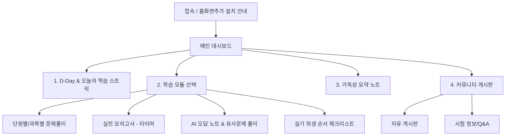

# 문신패스 (MuShinPass) — 전체 서비스 기획서 v2.0
> **문신사 국가시험 대비 PWA 플랫폼**  
> **기획 개발 스택**: Next.js 16 (App Router), Supabase, Vercel, Tailwind CSS, PWA  
> **최종 수정일**: 2026년 6월 5일  

---

## 1. 프로젝트 개요 & 비전

### 1.1. 배경
* **법령 시행**: 2027년 10월 29일 '문신사법' 본격 시행 및 2027년 말 첫 국가시험 주관 예정.
* **임시 특례 기간**: 기존 종사자는 2029년 10월까지 면허 없이 임시 등록 영업이 가능하나, 그 이후에는 시험 합격 및 면허 취득이 법적으로 필수화됨.
* **시장 규모**: 국내 현업 문신사 약 30만 명 및 신규 진입 희망자 대상 필수 교육 수요 존재.

### 1.2. 비전
> **"복잡한 기능 없이, 오직 합격만을 위한 가장 직관적인 학습 도구"**
* **화려함 배제, 가독성 극대화**: 수험생들의 연령대 분포(20대~50대)를 고려하여 눈 피로도가 적고 텍스트 가독성이 뛰어난 고대비·미색 디자인 적용.
* **PWA 기반 앱화**: 별도 앱 스토어 설치 없이 모바일 브라우저에서 '홈 화면에 추가'를 통해 네이티브 앱처럼 동작하는 가벼운 학습 환경 구축.
* **Supabase & AI 기반 효율화**: 백엔드 관리 포인트를 Supabase로 일원화하고, 틀린 문제를 분석하여 AI가 연관 오답 노트를 자동으로 생성.

---

## 2. 서비스 핵심 기능 설계

### 2.1. PWA 기반 최적화 및 가독성 디자인
* **디바이스 대응**: 모바일(세로형) 뷰를 최우선으로 설계한 반응형 웹.
* **오프라인 학습 모드**: 인터넷이 불안정한 이동 중에도 이미 로드된 문제 풀이 및 요약 노트 조회가 가능하도록 Service Worker 캐싱 활용.
* **가독성 특화 UI**:
  * 긴 지문을 읽기 편한 고대비 다크 모드 및 눈의 피로를 최소화하는 아이보리 톤 라이트 모드 지원.
  * 폰트 크기 조절 기능 내장.
  * 불필요한 배너나 애니메이션 효과를 전면 차단하여 학습 집중도 향상.

### 2.2. 학습 기능 (Study Modules)
1. **과목별 문제 풀이 (과목별 문제은행)**
   * 위생·감염 관리 / 법규·면허 / 색소·염료·재료 / 기초 해부·피부학
   * 학습 모드(한 문제씩 풀고 바로 정답 확인) vs 시험 모드(전체 풀고 채점) 지원.
2. **실기 준비 체크리스트**
   * 실기 시험의 특성을 반영한 작업대 세팅, 위생 전처리, 시술 단계별 체크리스트 암기 카드.
3. **AI 오답 분석 및 맞춤 출제**
   * 사용자가 틀린 문제를 DB에 누적.
   * AI(Claude API)가 틀린 문제의 오답 개념과 관련된 유사 문제를 실시간 생성하여 취약점 보완.
4. **실전 모의고사**
   * 타이머 작동(예: 60분).
   * 실제 출제 비율에 맞춘 60문항 무작위 출제 및 모의 성적 추이 그래프 기록.

### 2.3. 정보 및 D-Day 알림
* **원서 접수 및 시험일 D-Day 카운터** 메인 화면 상단 고정.
* 보건복지부 및 국시원 공고 변경 사항 발생 시 PWA 푸시 알림 발송.

### 2.5. 구글 검색 노출 (SEO) 최적화 전략
* **Next.js Metadata API**: 랜딩 페이지, 시험 안내 가이드, 커뮤니티 공개 게시글마다 고유한 메타 제목(Title), 설명(Description), 오픈그래프(OpenGraph) 태그를 서버 측에서 자동 주입하여 검색 결과 매칭률 극대화.
* **하이브리드 렌더링 전략 (SSR/SSG vs CSR)**:
  * 구글 봇이 로그인 없이 정보를 수집할 수 있도록 **랜딩 페이지**, **문신사법 요약 가이드**, **자주 묻는 질문(FAQ)**, **커뮤니티 공개 글** 등은 서버 사이드 렌더링(SSR) 또는 정적 생성(SSG)으로 처리하여 100% 검색 인덱싱 확보.
  * 로그인 세션이 필요한 개인 모의고사 풀이, 마이페이지 등은 클라이언트 사이드 렌더링(CSR)으로 신속한 사용자 반응 속도 확보.
* **동적 사이트맵 & robots.txt**: Next.js의 `app/sitemap.ts`를 활용하여 실시간으로 신규 생성되는 커뮤니티 글과 가이드북 페이지가 구글 색인에 즉시 반영되도록 자동 갱신되는 XML 사이트맵 구축.
* **JSON-LD 구조화 데이터 적용**: 시험 일정 정보, 법령 Q&A 등에 Schema.org의 구조화된 데이터(JSON-LD) 마크업을 적용하여 구글 검색 결과에서 별표 평점, FAQ 확장 목록 등 '리치 스니펫'을 획득하도록 유도.

---

## 3. 화면 흐름도 (User Flow)



---

## 4. 백엔드 및 데이터베이스 설계 (Supabase)

Supabase PostgreSQL 데이터베이스 기반 테이블 및 관계 스키마입니다.

### 4.1. `profiles` (사용자 프로필)
```sql
create table profiles (
  id uuid references auth.users on delete cascade primary key,
  email text unique not null,
  nickname text,
  target_exam_date date default '2027-11-30',
  streak_count integer default 0,
  last_active_date date,
  created_at timestamp with time zone default timezone('utc'::text, now()) not null
);
```

### 4.2. `questions` (문제은행 테이블)
```sql
create table questions (
  id bigint generated by default as identity primary key,
  subject text not null, -- 'hygiene', 'law', 'ink_material', 'anatomy'
  difficulty text check (difficulty in ('easy', 'medium', 'hard')),
  question_text text not null,
  options jsonb not null, -- {"1": "...", "2": "...", "3": "...", "4": "..."}
  correct_answer int not null, -- 1, 2, 3, 4
  explanation text not null,
  law_reference text, -- 관련 법률 조항명
  is_ai_generated boolean default false,
  created_at timestamp with time zone default timezone('utc'::text, now()) not null
);
```

### 4.3. `user_answers` (사용자 풀이 이력)
```sql
create table user_answers (
  id bigint generated by default as identity primary key,
  user_id uuid references profiles(id) on delete cascade not null,
  question_id bigint references questions(id) on delete cascade not null,
  user_answer int not null,
  is_correct boolean not null,
  solved_at timestamp with time zone default timezone('utc'::text, now()) not null
);
```

### 4.4. `posts` & `comments` (커뮤니티)
```sql
create table posts (
  id bigint generated by default as identity primary key,
  user_id uuid references profiles(id) on delete cascade not null,
  category text not null, -- 'free', 'qna', 'tip'
  title text not null,
  content text not null,
  created_at timestamp with time zone default timezone('utc'::text, now()) not null
);

create table comments (
  id bigint generated by default as identity primary key,
  post_id bigint references posts(id) on delete cascade not null,
  user_id uuid references profiles(id) on delete cascade not null,
  content text not null,
  created_at timestamp with time zone default timezone('utc'::text, now()) not null
);
```

---

## 5. AI 오답 자동 생성 파이프라인

1. **오답 수집**: 사용자가 모의고사나 일반 문제 풀이 중 틀린 문제 (`user_answers.is_correct = false`) 리스트를 Supabase에서 백그라운드로 로드.
2. **AI 프롬프트 작성**: 
   * 틀린 문제의 `question_text`, `correct_answer`, `explanation`을 추출.
   * AI 모델(Claude API)에 "해당 문제의 오답 원인이 되는 개념을 설명하고, 동일한 핵심 개념을 평가하되 지문과 보기가 다른 새로운 4지선다형 문제 1개를 JSON으로 출제하라"고 요청.
3. **결과 검증 및 적재**: 
   * 생성된 JSON 파싱 후 `questions` 테이블에 `is_ai_generated = true`로 삽입.
   * 생성된 고유 ID를 사용자의 개인 맞춤 오답 대기열로 배정하여 즉시 풀 수 있도록 연동.

---

## 6. 개발 및 PWA 배포 단계별 로드맵

### Phase 1: 로컬 세팅 & Supabase 환경 구축
* Next.js 16 App Router 기본 구조 구축.
* Supabase CLI를 활용한 DB 스키마 로컬 마이그레이션 적용.
* 기본적인 미색(Ivory/Charcoal) 가독성 중심 Tailwind CSS 테마 및 글로벌 폰트 설정.

### Phase 2: 핵심 학습 UI & PWA 최적화
* 모의고사 타이머 및 결과 리포트 화면 구현.
* `@ducanh2912/next-pwa` 모듈 연동 및 PWA 설치 매니페스트, 서비스 워커 오프라인 캐싱 동작 테스트.
* 폰트 및 라인 스페이싱 최적화 (가독성 집중 케어).

### Phase 3: AI 기반 오답 생성 & 커뮤니티 추가
* Supabase Edge Functions 또는 Next.js Route Handlers에서 Claude API 호출 구조 연동.
* 커뮤니티 게시판 CRUD 구축.

### Phase 4: 배포 및 운영
* Vercel로 원클릭 배포.
* Lighthouse Audit을 통한 성능 및 PWA 조건 충족 점검 (100점 목표).
